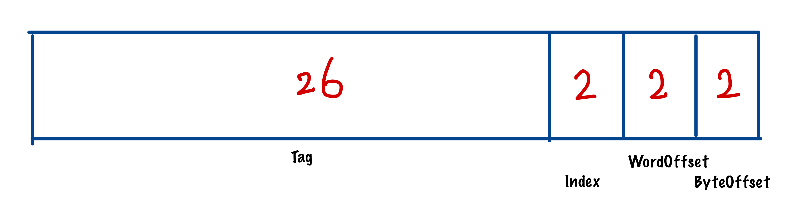
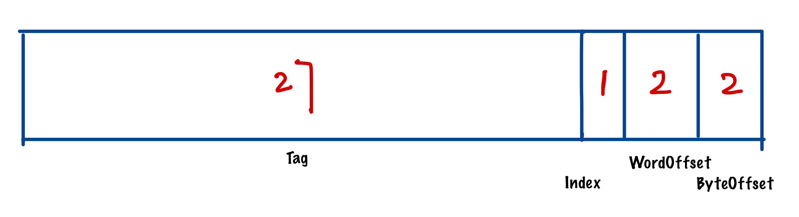
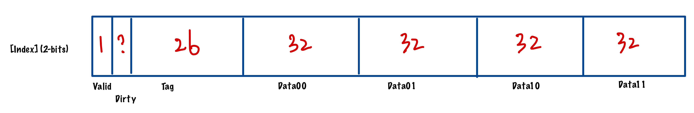
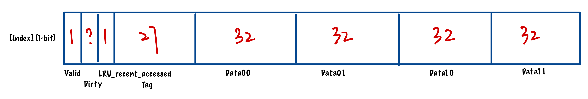

# Cache Memory Simulator
> *Not everything that's broken is meant to be fixed.* - T. Finch, P.O.I.

*A Cache Memory Simulator that supports write through / write back and Direct mapped / 2-way associative. Several cache replacement algorithms are also implemented in C.*

## Overview

This project uses `verilog` to simulate the datapath between CPU, Cache and Main Memory. It uses `c` to simulate a set of cache-replacement algorithms.

Fig 1. Overview of Cache memory datapath [1]

## Encoding and Standard

### Address Encoding

Fig 2. Address Encoding for direct-mapped cache

Fig 3. Address Encoding for 2-way associative cache

### Block Encoding

Fig 4. Block Encoding for direct-mapped cache

Fig 5. Block Encoding for 2-way associative cache

### Simulation Standard
The verilog program is simulated with `xvlog`. The board id is `XC7A35TCPG236-1`.

## Cache Replacement Algorithm

| Abbr.         | Algorithm                                       | Comment [^2]                                             |
| ------------- | ----------------------------------------------- | -------------------------------------------------------- |
| Optimal       | Optimal Cache Replacement Algorithm             | Not implementable in practice, but useful for evaluation |
| NRU           | Not Recently Used Cache Replacement Algorithm   | crude approximation of LRU                               |
| FIFO          | First-In, First-Out Cache Replacement Algorithm | might throw out important blocks                         |
| Second Chance | Second-Chance Cache Replacement Algorithm       | big improvement over FIFO                                |
| Clock         | Clock Cache Replacement Algorithm               | realistic                                                |
| LRU           | Least Recently Used Cache Replacement Algorithm | excellent, but difficult to implement in practice        |
| MRU           | Most Recently Used Cache Replacement Algorithm  | difficult to implement in practice                       |
| NFU           | Not Frequently Used Cache Replacement Algorithm | crude approximation to LRU                               |
| Aging         | Aging Cache Replacement Algorithm               | efficient algorithm that approximates LRU well           |
| Working Set   | Working Set Cache Replacement Algorithm         | expensive to implement                                   |
| WSClock       | WSClock Cache Replacement Algorithm             | excellent and efficient                                  |

## Reference
[^1]: VE370 Project Manual, *Professor G. Zheng*, UM-SJTU JI.

[^2]: Modern Operating System (4th Edition), *Andrew S. Tanenbaum*, Amsterdam, The Netherlands.